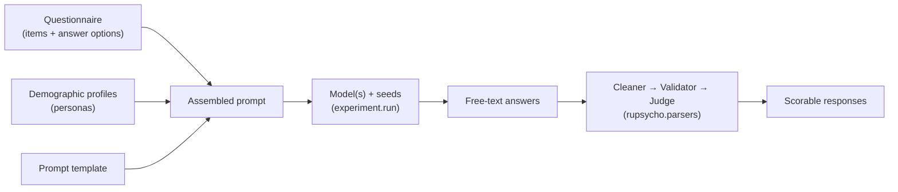

# Concepts

## Anatomy of an experiment

An **experiment** ([`ExperimentDocument`][rupsycho.experiment.ExperimentDocument]) bundles
everything needed to repeat a psychometric test on a language model:



| Component               | What it is                                                                 | Config key             |
| ----------------------- | -------------------------------------------------------------------------- | ---------------------- |
| **Questionnaire**       | A general instruction, items (questions), and answer options with weights. | `questionnaire`        |
| **Demographic profile** | A persona the model is asked to answer *as*, rendered from a template.     | `demographic_profiles` |
| **Prompt template**     | A plain, chat or LangChain template with the placeholders below.           | `prompt_template`      |
| **Model**               | One or more models with their generation parameters.                       | `models`               |
| **Seeds**               | Random seeds passed to the model; each seed gives one run.                 | `parameters.seeds`     |

Every field is described in the [Configuration Reference](configuration.md).

## Prompt placeholders

Prompt templates can use these variables:

| Placeholder             | Filled with                                                                                      |
| ----------------------- | ------------------------------------------------------------------------------------------------ |
| `{general_instruction}` | The questionnaire's general instruction                                                          |
| `{persona_description}` | The rendered demographic profile                                                                 |
| `{question}`            | The current item's question                                                                      |
| `{answer_options}`      | The item's answer options (or the questionnaire default), joined with the configured delimiter (default: comma and space) |

Any other placeholder makes the model call fail. Use
[`print_assembled_prompt`][rupsycho.mixins.experiment_processing.ExperimentProcessingMixin.print_assembled_prompt]
to look at the finished prompt before you run anything.

## The run loop

`experiment.run()` visits every combination of

```text
model × seed × item × persona
```

with the models in the outermost and the personas in the innermost loop. For each
combination it builds the chain `prompt | model | parser` (the parser defaults to a plain
string parser, see
[`set_parser`][rupsycho.experiment.ExperimentDocument.set_parser]), stores the answer on the
item and passes it, together with the generation time in seconds, to all
[callbacks](tutorials/callbacks.md).

- **Failing calls do not abort the run.** If invoking the chain raises an error, the error is
  logged (logger `rupsycho.mixins.experiment_processing`) and the answer is `None`: nothing is
  stored on the item and callbacks receive `None`. `run()` returns a `RunSummary` with the
  number of failed calls and warns once at the end (`on_error="raise"` stops at the first
  failure). Errors that happen outside of the call itself, such as a model that cannot be
  loaded, are raised. Errors inside a callback are reported as warnings.
- **Models are loaded lazily and released after use**, so several large models can be tested
  one after another on the same machine; the experiment keeps their configuration, so it can be
  run again.
- **Prompt inputs** (general instruction, persona description, question and answer options)
  are computed once per run and reused for every model and seed.
- **Concurrency** (`run(max_concurrency=N)`) runs calls in a thread pool for API models; results,
  callbacks and the progress bar keep the submission order and a failing call does not affect
  the others. Local Hugging Face models always run sequentially.

**Cumulative mode** (`run(cumulative=True)`) keeps a per-persona "response memory": each
earlier question and answer is prepended to the persona's prompt, which lets you study
consistency across a questionnaire. It needs a `chat` prompt with a system message followed by a
user message (messages after the user message are kept). Earlier questions are rendered with
their own values; braces in answers are escaped; calls that failed are not remembered.

## Reproducibility

- Every experiment is a **single configuration** that can be versioned and shared; exports mask
  API keys.
- `parameters.seeds` are applied to each model call in the way the back-end supports (local
  Hugging Face models, OpenAI, DeepSeek, Ollama and Hugging Face endpoints; Google cannot be
  seeded). **Set them explicitly** – if omitted, one random seed is drawn per experiment.
- Pin Hugging Face models with `revision` and record your environment.
- `print_assembled_prompt` / `assemble_prompt` show exactly what the model receives.
- Generation parameters live next to the model in the config, not in code.

See [Reproducibility](tutorials/reproducibility.md) for the details and caveats.

## From text to scores

Language models answer in free text ("I would say 4, because …"). The
[`rupsycho.parsers`](tutorials/postprocessing.md) package turns such output into a
valid response in three steps:

1. **Cleaners** strip noise, repeated prompt text or extract a pattern.
2. **Validators** flag refusals, apologies and "as an AI" answers.
3. **Judges** choose the answer option that best matches the cleaned text.

R.U.Psycho stores answer weights, the `reversed` flag and `ignored_for_scale` with the
questionnaire, but it does not compute scale scores; use the judged answer options and the
weights for that.
