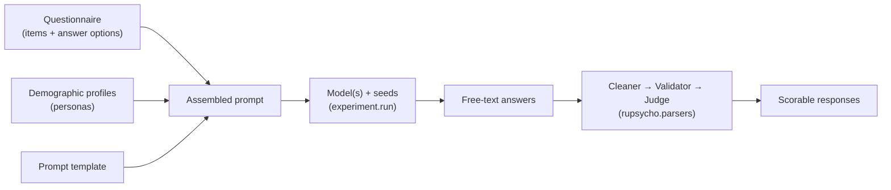

# Concepts

## Anatomy of an experiment

An **experiment** ([`ExperimentDocument`][rupsycho.experiment.ExperimentDocument]) bundles
everything needed to repeat a psychometric test on a language model:



| Component               | What it is                                                                 | Config key             |
| ----------------------- | -------------------------------------------------------------------------- | ---------------------- |
| **Questionnaire**       | A general instruction, items (questions), and answer options with weights. | `questionnaire`        |
| **Demographic profile** | A persona the model is asked to answer *as*, rendered from a template.     | `demographic_profiles` |
| **Prompt template**     | A plain, chat or LangChain template with the placeholders below.           | `prompt_template`      |
| **Model**               | One or more models with their generation parameters.                       | `models`               |
| **Seeds**               | Random seeds passed to the model; each seed gives one run.                 | `parameters.seeds`     |

Every field is described in the [Configuration Reference](configuration.md).

## Prompt placeholders

Prompt templates can use these variables:

| Placeholder             | Filled with                                                                                      |
| ----------------------- | ------------------------------------------------------------------------------------------------ |
| `{general_instruction}` | The questionnaire's general instruction                                                          |
| `{persona_description}` | The rendered demographic profile                                                                 |
| `{question}`            | The current item's question                                                                      |
| `{answer_options}`      | The item's answer options (or the questionnaire default), joined with the configured delimiter (default: comma and space) |

Any other placeholder makes the model call fail. Use
[`print_assembled_prompt`][rupsycho.mixins.experiment_processing.ExperimentProcessingMixin.print_assembled_prompt]
to look at the finished prompt before you run anything.

## The run loop

`experiment.run()` visits every combination of

```text
model × seed × item × persona
```

with the models in the outermost and the personas in the innermost loop. For each
combination it builds the chain `prompt | model | parser` (the parser defaults to a plain
string parser, see
[`set_parser`][rupsycho.experiment.ExperimentDocument.set_parser]), stores the answer on the
item and passes it, together with the generation time in seconds, to all
[callbacks](tutorials/callbacks.md).

- **Failing calls do not abort the run.** If invoking the chain raises an error, the error is
  logged (logger `rupsycho.mixins.experiment_processing`, level `ERROR`) and the answer is
  `None`: nothing is stored on the item and callbacks receive `None`. Errors that happen
  outside of the call itself, such as a model that cannot be loaded, are raised and stop the
  run. Errors inside a callback are reported as warnings.
- **Models are loaded lazily and released after use**, so several large models can be tested
  one after another on the same machine. As a consequence an experiment can be run only
  once: reload it (or add the models again) to run it a second time.
- **Prompt inputs** (general instruction, persona description, question and answer options)
  are computed once per model and reused for every seed. The chain is built once per model
  and seed (in cumulative mode once per call, because the prompt changes with every answer).

**Cumulative mode** (`run(cumulative=True)`) keeps a per-persona "response memory":
each earlier question and answer is appended to the persona's prompt, which lets you
study consistency across a questionnaire. It needs a `chat` prompt with a system message
followed by a user message. Placeholders other than `{question}` are only allowed in the
system message; the user message may contain `{question}` and plain text without any
other braces.

## Reproducibility

- Every experiment is a **single configuration** that can be versioned and shared.
- `parameters.seeds` are passed to each model call as `seed=<int>`. **Set them explicitly** –
  if omitted, one random seed is drawn per experiment, so two experiments loaded from the
  same file get different seeds.
- Whether a seed makes the output deterministic depends on the back-end. Hosted APIs that
  support a seed (such as OpenAI) use it on a best-effort basis; Google models do not accept
  a seed, so none is passed; local Hugging Face pipelines currently ignore it. For
  identical reruns of local models, turn sampling off (`"do_sample": false`) in the model's
  `parameters`.
- `print_assembled_prompt` shows exactly what the model receives.
- Generation parameters live next to the model in the config, not in code.
- `export_to_file` stores the configuration together with all answers, so keep the exported
  file with your results.

## From text to scores

Language models answer in free text ("I would say 4, because …"). The
[`rupsycho.parsers`](tutorials/postprocessing.md) package turns such output into a
valid response in three steps:

1. **Cleaners** strip noise, repeated prompt text or extract a pattern.
2. **Validators** flag refusals, apologies and "as an AI" answers.
3. **Judges** choose the answer option that best matches the cleaned text.

R.U.Psycho stores answer weights, the `reversed` flag and `ignored_for_scale` with the
questionnaire, but it does not compute scale scores; use the judged answer options and the
weights for that.
