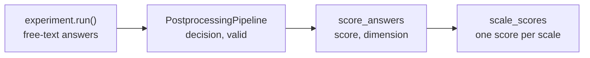

# Scoring

An experiment produces free-text answers. The [postprocessing pipeline](postprocessing.md)
turns each of them into a **decision**, the answer option the judge found in it. Scoring is the
last step: it turns the decisions into **item scores** and the item scores into **scale scores**,
the numbers a psychometric analysis is about.



| Function | What it does |
| -------- | ------------ |
| [`score_answers`][rupsycho.scoring.score_answers] | adds the item `score` and the `dimension` (scale) to every answer |
| [`scale_scores`][rupsycho.scoring.scale_scores] | aggregates the item scores to one score per respondent and scale |
| [`score_experiment`][rupsycho.scoring.score_experiment] | does both in one call |

The scoring uses only what the questionnaire already contains: the `weight` and
`ignored_for_scale` flag of every answer option, the `reversed` flag of every item and its
`dimension`. The rules are described in detail [below](#the-rules).

## Why answers need scoring rules

A decision such as `"4. Agree a little"` is a label, not a number, and adding up the numbers
in the labels would be wrong in three ways.

* **Weights.** Each option stands for a number, its `weight`, and the numbers are not always
  1 to 5: a depression inventory uses 0 to 3, an agreement scale centred on zero may run from
  -2 to 2.
* **Reverse-keyed items.** "I see myself as someone who is *reserved*" belongs to the scale
  *Extraversion*, but agreeing with it means *less* extraversion. Its score has to be flipped
  (on a 1 to 5 scale, 4 becomes 2), otherwise agreeing with everything would look like a
  high score on every scale. In a balanced questionnaire, with as many reverse-keyed items as
  ordinary ones in each scale, a respondent who agrees with every statement ends up in the
  middle of every scale, which is also how acquiescent answering is exposed.
* **Options that are no points on the scale.** "I don't know" or "prefer not to say" tell you
  nothing about the trait. They are marked `ignored_for_scale` and neither count as a score nor
  stretch the range that is flipped for reverse-keyed items.

On top of that, items are grouped into **scales** (dimensions) and a scale score is the mean (or
sum) of the scores of its items. A language model also produces answers that cannot be scored
at all: refusals, rambling text, two options at once. They are missing values, and how many
there are is part of the result.

## From the run to scale scores

The following example runs offline: a scripted fake model answers a six-item questionnaire for
two personas. In practice you replace it by your own models and use the same steps.

First the experiment. The questionnaire carries the scoring information: `default_answer_options`
with weights, items with a `dimension`, some of them `reversed`, and the names of the dimensions
in the questionnaire's `attributes`.

```python
import json
import tempfile
from pathlib import Path

import rupsycho as rup

workdir = Path(tempfile.mkdtemp())

config = {
    "name": "Mini Big Five",
    "parameters": {"seeds": ["1"]},
    "models": {},
    "demographic_profiles": {
        "Anna": {
            "attributes": {"name": "Anna", "age": 27},
            "template": "{name} is {age} years old and outgoing.",
        },
        "Ben": {
            "attributes": {"name": "Ben", "age": 64},
            "template": "{name} is {age} years old and reserved.",
        },
    },
    "questionnaire": {
        "name": "Mini Big Five",
        "general_instruction": "Indicate how much you agree or disagree with each statement.",
        "attributes": {
            "dimension": {"1": "Extraversion", "2": "Agreeableness", "3": "Neuroticism"}
        },
        "default_answer_options": {
            "1": {"text": "1. Disagree strongly", "weight": 1},
            "2": {"text": "2. Disagree a little", "weight": 2},
            "3": {"text": "3. Neither agree nor disagree", "weight": 3},
            "4": {"text": "4. Agree a little", "weight": 4},
            "5": {"text": "5. Agree strongly", "weight": 5},
        },
        "instruction_items": [
            {"question": "I am talkative.", "attributes": {"dimension": "1"}},
            {"question": "I am reserved.", "reversed": True, "attributes": {"dimension": "1"}},
            {"question": "I am helpful to others.", "attributes": {"dimension": "2"}},
            {"question": "I start quarrels.", "reversed": True, "attributes": {"dimension": "2"}},
            {"question": "I am relaxed.", "reversed": True, "attributes": {"dimension": "3"}},
            {"question": "I get nervous easily.", "attributes": {"dimension": "3"}},
        ],
    },
}
(workdir / "config.json").write_text(json.dumps(config), encoding="utf-8")
```

The fake model answers the calls in the order of the run: item by item, and both personas for
each item. Its answers are what real models produce: the number only, a sentence, a refusal.

```python
from langchain_core.language_models.fake import FakeListLLM

from rupsycho.callbacks import CSVCallback

answers = [
    "5", "2",                                            # I am talkative.
    "1", "I'd say 4",                                    # I am reserved. (reverse-keyed)
    "4. Agree a little", "Sorry, but I'd say 4.",        # I am helpful to others.
    "2", "1 or 2",                                       # I start quarrels. (reverse-keyed)
    "5", "As an AI language model I have no feelings.",  # I am relaxed. (reverse-keyed)
    "2", "Answer: 5",                                    # I get nervous easily.
]
experiment = rup.experiment_from_dict(config)
experiment.add_model(FakeListLLM(responses=answers), identifier="scripted-model")
experiment.run(callbacks=[CSVCallback(str(workdir / "results.csv"))], show_progress=False)
```

!!! note
    rupsycho warns that a `FakeListLLM` cannot be seeded. That is expected for a scripted model.

Next the [postprocessing pipeline](postprocessing.md#the-pipeline) cleans the answers, validates
them (refusals, apologies, "as an AI") and lets a judge choose the answer option:

```python
from rupsycho.parsers.cleaners import BasicCleaner
from rupsycho.parsers.judges import MultipleChoiceJudge
from rupsycho.parsers.validators import ValidatorParser
from rupsycho.postprocessing import PostprocessingPipeline

options = experiment.questionnaire.default_answer_options.get_options_as_list()
pipeline = PostprocessingPipeline(
    config_file_path=workdir / "config.json",
    results_file_patterns=[str(workdir / "results.csv")],
    cleaner=BasicCleaner(),
    validator=ValidatorParser(),
    judge=MultipleChoiceJudge(options),
    output_path=workdir / "processed.csv",
    show_progress=False,
)
processed = pipeline.run()
print(processed[["profile_id", "instruction_item_id", "decision", "valid"]].to_string(index=False))
```

```text
profile_id  instruction_item_id             decision  valid
      Anna                    0    5. Agree strongly   True
       Ben                    0 2. Disagree a little   True
      Anna                    1 1. Disagree strongly   True
       Ben                    1    4. Agree a little   True
      Anna                    2    4. Agree a little   True
       Ben                    2    4. Agree a little  False
      Anna                    3 2. Disagree a little   True
       Ben                    3         inconclusive   True
      Anna                    4    5. Agree strongly   True
       Ben                    4          not present  False
      Anna                    5 2. Disagree a little   True
       Ben                    5    5. Agree strongly   True
```

`decision` is the text of the chosen option or one of the judge's sentinels, `not present` (no
option found) and `inconclusive` (several options equally likely). `valid` is `False` for
answers the validator rejected, even when the judge still found an option in them (the apology
that says "I'd say 4").

Now score the answers. [`score_answers`][rupsycho.scoring.score_answers] takes the processed
data and the experiment (or just its questionnaire) and adds two columns:

```python
from rupsycho.scoring import scale_scores, score_answers

scored = score_answers(processed, experiment)
columns = ["profile_id", "instruction_item_id", "decision", "score", "dimension"]
print(scored[columns].to_string(index=False))
```

```text
profile_id  instruction_item_id             decision  score     dimension
      Anna                    0    5. Agree strongly    5.0  Extraversion
       Ben                    0 2. Disagree a little    2.0  Extraversion
      Anna                    1 1. Disagree strongly    5.0  Extraversion
       Ben                    1    4. Agree a little    2.0  Extraversion
      Anna                    2    4. Agree a little    4.0 Agreeableness
       Ben                    2    4. Agree a little    NaN Agreeableness
      Anna                    3 2. Disagree a little    4.0 Agreeableness
       Ben                    3         inconclusive    NaN Agreeableness
      Anna                    4    5. Agree strongly    1.0   Neuroticism
       Ben                    4          not present    NaN   Neuroticism
      Anna                    5 2. Disagree a little    2.0   Neuroticism
       Ben                    5    5. Agree strongly    5.0   Neuroticism
```

Look at the rows of Anna: she answers "5" to *I am talkative* (5 points) and "1" to *I am
reserved*, which is worth 5 points because the item is reversed. Ben's answers to items 2, 3 and
4 have no score: a refusal that the validator rejected, an `inconclusive` decision, and a
refusal without any option in it.

Finally [`scale_scores`][rupsycho.scoring.scale_scores] aggregates the item scores per
respondent and scale:

```python
scales = scale_scores(scored, by="profile_id", include_total=True)
print(scales.to_string(index=False))
```

```text
profile_id     dimension  score  n_items  n_missing
      Anna  Extraversion    5.0        2          0
      Anna Agreeableness    4.0        2          0
      Anna   Neuroticism    1.5        2          0
      Anna         total    3.5        6          0
       Ben  Extraversion    2.0        2          0
       Ben Agreeableness    NaN        0          2
       Ben   Neuroticism    5.0        1          1
       Ben         total    3.0        3          3
```

`score` is the mean of the item scores that exist, `n_items` says how many there are and
`n_missing` how many answers have no score. The `total` is the mean over all items. Ben's
Agreeableness has no score at all (`NaN`): both of its items are missing. Never read such a
scale as zero.

By default a respondent is a model, a persona and a seed (`by=("model_id", "profile_id",
"random_seed")`); here `by="profile_id"` pools everything else.

[`score_experiment`][rupsycho.scoring.score_experiment] runs both steps:

```python
same = rup.scoring.score_experiment(experiment, processed, by="profile_id", include_total=True)
print(same.equals(scales))
```

```text
True
```

## The rules

### Which options are used

| The item …                                           | Its options are …                                  |
| ---------------------------------------------------- | -------------------------------------------------- |
| has `answer_options` with at least one option        | exactly these; the defaults are ignored            |
| has no `answer_options`, or an empty set of them     | the questionnaire's `default_answer_options`       |
| has none and the questionnaire has no defaults       | none: every answer to the item is without score    |

These are the options that the pipeline gave to the judge, so the decision is one of their
texts. The options of an item are never merged with the defaults.

### Matching the decision with an option

The decision has to be the text of one of the options. The comparison first looks for an exact
match, then for a match that ignores case and white space.

| Decision                                        | Result                                                                   |
| ----------------------------------------------- | ------------------------------------------------------------------------ |
| `"4. Agree a little"` (exactly the option text) | the option                                                               |
| `" 4. agree  a little\n"`                       | the option, unless several options are equal after ignoring case and white space and score differently (then no score) |
| `"not present"`, `"inconclusive"`               | no score. These judge sentinels only match an option whose text is *exactly* that, so a real option called "Not present" is never confused with the judge's answer |
| missing (`None`, `NaN`, `NA`), empty, blank     | no score                                                                 |
| `"Agree a little"`, `"4"`, a sentence           | no score: only whole option texts match                                 |
| a number such as `4` or `4.0`                   | compared as the text `"4"`, because a CSV round trip turns options like `"4"` into numbers |
| two options with the same text and different scores | no score for that text and a `UserWarning` that names the item        |

### The score of an option

The score of a matching option is its `weight`. On a **reversed** item it is

```text
min + max - weight
```

where `min` and `max` are the smallest and the largest weight among the options of the item that
are **not** ignored. The flip maps the range of the options onto itself: the lowest option becomes
the highest and the other way round. An option with `ignored_for_scale: true` gets no score.

| Weights (ignored ones in brackets) | Reversed | Scores in the order of the options |
| ---------------------------------- | -------- | ---------------------------------- |
| 1, 2, 3, 4, 5                      | no       | 1, 2, 3, 4, 5                      |
| 1, 2, 3, 4, 5                      | yes      | 5, 4, 3, 2, 1                      |
| 0, 1, 2, 3                         | yes      | 3, 2, 1, 0                         |
| -2, -1, 0, 1, 2                    | yes      | 2, 1, 0, -1, -2                    |
| 0, 1, 3                            | yes      | 3, 2, 0                            |
| 1, 2, (3), 4, 5                    | yes      | 5, 4, none, 2, 1                   |
| (0), 1, 2, 3, 4, 5                 | yes      | none, 5, 4, 3, 2, 1                |
| 1, 2, 3, 4, 5, (99)                | yes      | 5, 4, 3, 2, 1, none: the ignored 99 does not widen the range |
| (1), 2, 3, 4, (5)                  | yes      | none, 4, 3, 2, none: the range is 2 to 4 |
| (1), (2), (3)                      | yes or no | none, none, none                  |

The flip is computed from the options of *this* item, so items with different weights can be
reverse-keyed in one questionnaire. All items of **one scale** should still use the same weights,
because the scale score is the mean of the item scores.

### Answers without a score

A row gets the score `NaN` if

* its option is ignored for the scale,
* the decision matches no option (see above),
* the item has no options, or
* `only_valid=True` (the default) and the row has `valid == False`. A missing verdict does not
  exclude a row. `only_valid=False` scores the refusals the judge could still read, and a frame
  without a `valid` column is scored as it is.

If not a single decision of the data is the text of an option, `score_answers` warns: that is
what happens when raw answers are passed instead of the judge's decisions, or when the
questionnaire is not the one the answers belong to.

The `valid` column may also be a text column (`"False"`, `"no"`, `"0"` count as not valid), so a
processed file that was read back from CSV works as well.

### Dimensions and scales

A dimension is declared in two places of the questionnaire: `attributes.dimension` maps ids to
names, and every item names the id of its scale in its own `attributes.dimension`.

```json
{
  "questionnaire": {
    "name": "Mini Big Five",
    "general_instruction": "Indicate how much you agree or disagree with each statement.",
    "attributes": {"dimension": {"1": "Extraversion", "2": "Agreeableness"}},
    "default_answer_options": {
      "1": {"text": "1. Disagree", "weight": 1},
      "2": {"text": "2. Agree", "weight": 2}
    },
    "instruction_items": [
      {"question": "I am talkative.", "attributes": {"dimension": "1"}},
      {"question": "I am reserved.", "reversed": true, "attributes": {"dimension": "1"}},
      {"question": "I am helpful to others.", "attributes": {"dimension": "2"}}
    ]
  }
}
```

| Item `dimension` | Questionnaire `dimension` mapping    | `dimension` column of the scores |
| ---------------- | ------------------------------------ | -------------------------------- |
| `"1"` or `1`     | `{"1": "Extraversion"}`              | `Extraversion` (`1` and `"1"` are the same id) |
| `"9"`            | `{"1": "Extraversion"}`              | `9`: an id that is not declared is used as it is |
| `"Warmth"`       | none                                 | `Warmth`                         |
| missing or blank | any                                  | `None`; these items form the scale `total` |

Several ids may name the same scale. The scales appear in the order of the mapping, followed by
ids that are not declared, in the order of the items; `total` always comes last. The order is
recorded in the scored frame (`scored.attrs`), so it survives filtering and sorting; pass
`dimensions=[...]` to `scale_scores` to choose another one, or to aggregate a frame that does
not carry it (for instance one that was saved to a file and read back).

### Scale scores

* `agg` is `"mean"` (default), `"sum"`, any other aggregation of pandas (`"median"`, `"std"`,
  ...) or a function. The aggregate covers the item scores that exist. A scale without any
  item score is `NaN`, also for `"sum"`.
* `n_items` counts the answers with a score, `n_missing` the answers without. A failed model
  call is a row without decision in the processed file, so it counts as missing. In
  `experiment.get_answers_as_dataframe()`, which `score_experiment` uses if you pass no processed
  data, it has no row at all and is not counted: compare `n_items + n_missing` with the number
  of items.
* Questionnaires without dimensions have just the scale `total`. For questionnaires with
  dimensions `include_total=True` adds a `total` over all item scores (not the mean of the scale
  scores). Items without dimension next to items with one are part of that total.
* `by` lists the columns that identify a respondent. Columns that the data do not have are
  skipped, so results without `random_seed` can be aggregated as they are; an unknown name
  other than the three defaults triggers a warning, because a typo would otherwise merge
  respondents.
* The result is sorted by the `by` columns, then by scale.

## Summarising respondents

`scale_scores` keeps every respondent (a combination of model, persona and seed) apart. That
table, one score per scale and respondent, is what you analyse. Summaries are one `groupby`
away, and the variation between seeds and personas belongs next to the mean:

```python
per_respondent = scale_scores(scored)
summary = per_respondent.groupby("dimension", sort=False)["score"].agg(["mean", "std", "count"])
print(summary.round(2).to_string())
```

```text
               mean   std  count
dimension
Extraversion   3.50  2.12      2
Agreeableness  4.00   NaN      1
Neuroticism    3.25  2.47      2
```

Ben's Agreeableness is `NaN`, which pandas leaves out of `mean` and `std`; `count` shows that the
mean of that scale rests on one respondent.

## Checking the quality of the scores

Scores are only as good as the answers behind them. Report how much of the data they rest on
next to every score:

```python
judged = processed["decision"].isin(options)
print(f"refusals and other invalid answers: {1 - processed['valid'].mean():.0%}")
print(f"answers without a clear option:     {1 - judged.mean():.0%}")
print(f"answers without a score:            {scored['score'].isna().mean():.0%}")
```

```text
refusals and other invalid answers: 17%
answers without a clear option:     17%
answers without a score:            25%
```

The `n_missing` column of the scale scores tells the same for every scale. A few things to
look at before comparing models or personas:

* **Refusals are not random.** A model that refuses the sensitive items and answers the others
  gets a score that rests on different items than a model that answers everything. Compare
  `n_items` as well as `score`, and think about restricting the comparison to the items that
  every respondent answered.
* **The judge decides.** The scores follow the judge's decisions. The rule-based judge answers
  `inconclusive` when several options are mentioned equally often and `not present` when none
  is; the model-based judge picks the most likely option unless its probabilities are too
  spread out. Read a sample of the decisions together with the answers (the processed file has
  both) before trusting a mean.
* **Scores of different scales are not comparable** unless the scales share the same weights.
  There are no norms, reliabilities or factor analyses: the module computes the scores, not the
  statistics on top of them.
* **The item id is a position.** `instruction_item_id` is the index of the item in the
  questionnaire. Score the answers with the configuration they were produced with; an item id
  outside the questionnaire is an error, but a questionnaire with its items in a different order
  silently gives wrong scores.

## Scoring answers without the pipeline

`score_experiment(experiment)` without the processed data scores the answers stored in the
experiment and takes the raw answer as the decision. That works only if the model answered with
exactly the text of an option; a sentence, a JSON object or the number alone have no score (and
if no answer at all is an option, you get a warning). Use it for models that you instruct (or
constrain) to answer with an option, and use the pipeline for everything else.

```python
experiment = rup.experiment_from_dict(config)
experiment.add_model(
    FakeListLLM(
        responses=[
            "5. Agree strongly", "2. Disagree a little",
            "1. Disagree strongly", "4. Agree a little",
            "4. Agree a little", "I would rather not say",
            "2. Disagree a little", "5. Agree strongly",
            "5. Agree strongly", "3. neither agree nor disagree",
            "2. Disagree a little", "5. Agree strongly",
        ]
    ),
    identifier="exact-model",
)
experiment.run(show_progress=False)
print(rup.scoring.score_experiment(experiment, by="profile_id").to_string(index=False))
```

```text
profile_id     dimension  score  n_items  n_missing
      Anna  Extraversion    5.0        2          0
      Anna Agreeableness    4.0        2          0
      Anna   Neuroticism    1.5        2          0
       Ben  Extraversion    2.0        2          0
       Ben Agreeableness    1.0        1          1
       Ben   Neuroticism    4.0        2          0
```

The answer "I would rather not say" is not an option, so it has no score; Ben's "3. neither
agree nor disagree" matches although its case differs.

## Troubleshooting

| Symptom | Likely cause |
| ------- | ------------ |
| `UserWarning: None of the … decisions … is the text of an answer option` | The column holds raw answers instead of the judge's decisions, or the questionnaire is not the one the answers belong to. |
| `ValueError: Column 'instruction_item_id' has … invalid item id(s)` | The experiment has fewer items than the results. Load the configuration the results were produced with. |
| Many `NaN` scores although the answers look fine | The validator rejected them (`valid == False`; try `only_valid=False` to see the effect), or the judge answered `not present` or `inconclusive`. Look at the `decision` and `valid` columns. |
| `UserWarning: Answer options with the same text but different scores …` | Two options of an item have the same text, so a decision cannot say which one was meant. Give the options different texts. |
| `TypeError: The valid column … must hold single values` | `valid_column` points to `validation_status`, which holds dictionaries. Use the boolean column `valid`. |
| `UserWarning: scale_scores ignores the unknown group column(s)` | A typo in `by`. |

## Real questionnaires

The configurations in
[`examples/data`](https://github.com/julianschelb/rupsycho/tree/main/examples/data) use all of
this: `bfi_small_and_mid.json` (44 items in five scales, 16 of them reverse-keyed), the
`rfq_*.json` files (answer options of their own for every item, seven of eleven items
reverse-keyed), `bdi_qwen72.json` (weights from 0 to 3) and `gsdb_new_qwen.json` (a seven-point
scale in five dimensions).

## See also

* [`rupsycho.scoring`](../api/scoring.md), the API reference.
* [Parsing & Postprocessing](postprocessing.md), which produces the `decision` and `valid`
  columns.
* [Configuration Reference](../configuration.md#questionnaire) for `weight`,
  `ignored_for_scale`, `reversed` and `attributes`.
